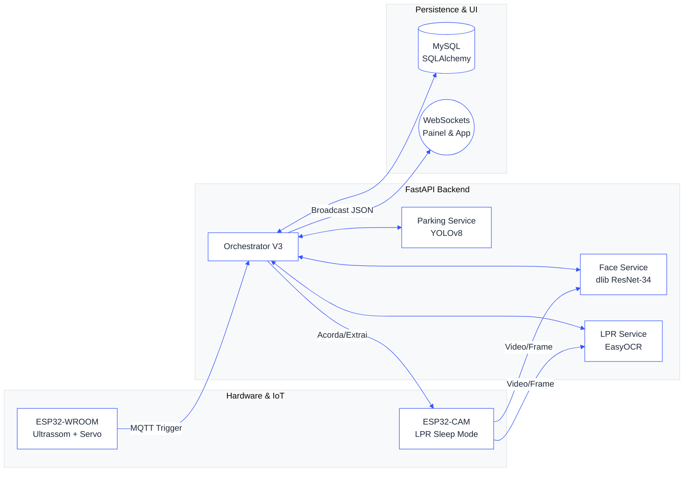

<div align="center">
  
  <br><br>
  
  
  
  
  
</div>

<br>

> **A SEGURANÇA CONDOMINIAL REDEFINIDA.** 
>
> Vulnerabilidades analógicas e portarias suscetíveis a fraudes ficaram no passado. O **ParkSync** propõe a eliminação completa de cancelas manuais e totens de tickets através de uma Matriz de Decisão Biométrica (Facial + LPR). O sistema garante 100% de rastreabilidade de acessos, alertas de invasão instantâneos e gerenciamento autônomo de conflitos no pátio de vagas utilizando processamento distribuído (IoT Edge + AI Backend).
>
> *Desenvolvido como requisito para a obtenção do título de Técnico em Desenvolvimento de Sistemas.*

<br>

<div align="center">
░░░▒▒▒░░░▒▒▒░░░▒▒▒░░░▒▒▒░░░▒▒▒░░░▒▒▒░░░▒▒▒░░░▒▒▒░░░▒▒▒░░░▒▒▒░░░
</div>

<br>

## 🗺️ Arquitetura do Sistema

O ParkSync opera em uma infraestrutura fragmentada e eficiente. O módulo de IoT escuta o ambiente e desperta o backend via **MQTT**. O orquestrador assume o comando, processa o *match* duplo com IA e emite os resultados em tempo real via **WebSockets** para a interface da guarita.



<br>

<div align="center">
░░░▒▒▒░░░▒▒▒░░░▒▒▒░░░▒▒▒░░░▒▒▒░░░▒▒▒░░░▒▒▒░░░▒▒▒░░░▒▒▒░░░▒▒▒░░░
</div>

<br>

## ⚙️ Funcionalidades Principais e Matriz de Decisão

A lógica de acesso da portaria é controlada por 5 Cenários Críticos avaliados pelo `orchestrator.py` (~207 linhas), priorizando sempre a biometria facial sobre a identificação veicular.

| Cenário | Condição | Ação do Sistema |
| :--- | :--- | :--- |
| **Morador Perfeito** | Face ✅ + Placa ✅ | Acesso liberado, vaga alocada. |
| **Morador Temporário** | Face ✅ + Placa ❌ | Acesso liberado autonomamente. Placa registrada temporariamente para evitar conflitos no pátio. |
| **Invasão** | Face ❌ + Placa ❌ | Cancela travada, snapshot gravado em auditoria e alerta disparado ao porteiro. |
| **Visitante Autorizado** | Face ❌ + Placa (Agenda ✅) | Captura de face obrigatória, log de segurança e liberação da cancela. |
| **Visitante Expirado** | Face ❌ + Placa (Agenda ❌) | Cancela travada e acionamento de mediação manual via WebSockets. |

> 🅿️ **Parking Detection System:** No pátio interno, o algoritmo processa variações poligonais via Laplacian (OpenCV). Se houver alteração, valida com **YOLOv8n** e aciona o **EasyOCR** para cruzar a placa com o banco de dados, emitindo status de conflito instantâneo.

<br>

<div align="center">
░░░▒▒▒░░░▒▒▒░░░▒▒▒░░░▒▒▒░░░▒▒▒░░░▒▒▒░░░▒▒▒░░░▒▒▒░░░▒▒▒░░░▒▒▒░░░
</div>

<br>

## 🛠️ Stack Tecnológica

| Camada | Tecnologia | Função no Ecossistema |
| :--- | :--- | :--- |
| **API & Core** | Python 3.11, FastAPI | Gerenciamento de WebSockets, 9 endpoints REST e orquestração. |
| **Banco de Dados** | MySQL, SQLAlchemy | Persistência transacional com 5 Models e 15+ Schemas Pydantic. |
| **IoT & Mensageria** | Mosquitto MQTT | Comunicação (Pub/Sub) e disparo de eventos via ESP32. |
| **Visão Computacional** | OpenCV, dlib | Cálculo de vetores faciais (128 embeddings) com ~99% de acurácia. |
| **Inteligência Artificial** | YOLOv8n, EasyOCR | Detecção de veículos e LPR (License Plate Recognition) treinado do zero. |
| **Hardware Edge** | ESP32-CAM, ESP32-WROOM | Automação de cancela (servo) e captura de frames em modo sleep. |

<br>

<div align="center">
░░░▒▒▒░░░▒▒▒░░░▒▒▒░░░▒▒▒░░░▒▒▒░░░▒▒▒░░░▒▒▒░░░▒▒▒░░░▒▒▒░░░▒▒▒░░░
</div>

<br>

## 🖋️ Autoria

```text
██████╗  █████╗ ██████╗ ██╗  ██╗███████╗██╗   ██╗███╗   ██╗ ██████╗ 
██╔══██╗██╔══██╗██╔══██╗██║ ██╔╝██╔════╝╚██╗ ██╔╝████╗  ██║██╔════╝ 
██████╔╝███████║██████╔╝█████╔╝ ███████╗ ╚████╔╝ ██╔██╗ ██║██║      
██╔═══╝ ██╔══██║██╔══██╗██╔═██╗ ╚════██║  ╚██╔╝  ██║╚██╗██║██║      
██║     ██║  ██║██║  ██║██║  ██╗███████║   ██║   ██║ ╚████║╚██████╗ 
╚═╝     ╚═╝  ╚═╝╚═╝  ╚═╝╚═╝  ╚═╝╚══════╝   ╚═╝   ╚═╝  ╚═══╝ ╚═════╝ 
```

**Desenvolvedor:** João Guilherme da Silva - Full-Stack IoT
* **GitHub:** [GhostDev-Creator](https://github.com/GhostDev-Creator)

**Desenvolvedora:** Emily Cesar Moreira - Front-End Mobile
* **GitHub:** [EmilyMoreira02](https://github.com/EmilyMoreira02)

**Desenvolvedor:** Hudson Henrique Silva Bento - Front-End Mobile
* **GitHub:** [hudson1902](https://github.com/hudson1902)

Projeto desenvolvido como Trabalho de Conclusão de Curso (Jan/2026). Distribuído sob a licença CC BY-NC 4.0.
